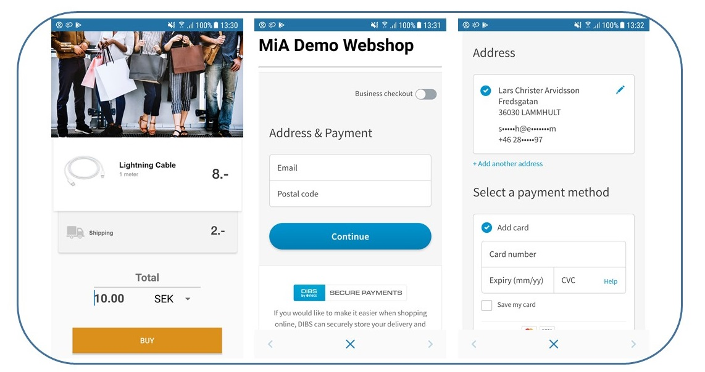
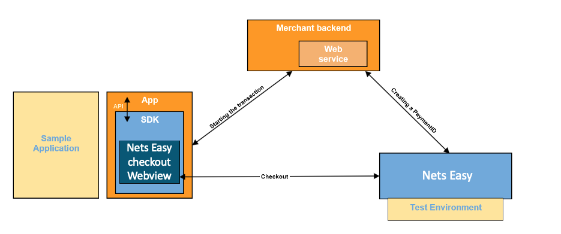

# Easy - Android SDK v1.3.0
----


MiA Easy Android SDK is a library which facilitates the Embedded DIBS Easy Checkout integration in your Android application

Detailed documentation can be found [here](https://htmlpreview.github.io/?https://github.com/DIBS-Payment-Services/Easy-Android-SDK/blob/master/documentation/Start%20-%20Overview%20of%20MiA%20Android%20SDK.html).

+ **Nets Easy** technical documentation can be found [here](https://tech.dibspayment.com/easy)
+ **Nets Easy API documentation** can be found [here](http://tech.dibspayment.com/easy/api)
+ **Nets Easy checkout guide (Re-direct)** can be found [here](https://tech.dibspayment.com/node4555edit/checkout-introduction)
+ **Easy - iOS SDK** can also be found [here](https://github.com/DIBS-Payment-Services/Easy-iOS-SDK)


|  |  
| --- |


# Installation
----
In your `build.gradle` application level file, add:
```gradle
implementation('eu.nets.mia:mia-sdk:1.3.0') { transitive = true;}
```
    
**Note:** the library is available through both `jcenter()` and `mavenCentral()` repositories.

# Requirements
----
**Minimum supported Android version is 5.1** 

# Permissions
----
These permissions are handled inside the binary, and your integration won't require any additional changes.

**MiA SDK** will require the internet permissions to be fully operational.

```xml
<uses-permission android:name="android.permission.INTERNET" />
```

# Examples
----

We have provided a [Sample Application](MiaSample/) to help you understand the use cases of the SDK functionalities. All you need to do is checkout the project and run it. Check our [Overview Documentation](documentation/) for best-practices to keep in mind when you build your integration.

# High level architecture of the Easy SDK
---
The below picture illustrates the SDK and its interactions with the macro components of the integration's environment.


# Usage
----
Assuming you have already created your backend integration towards `Easy Payment APIs`, the SDK can be launched by simply calling:
```kotlin
/**
    *
    * @param paymentId the paymentId received in Create Payment API call
    * @param checkoutUrl the checkout page url used in Create Payment API call  
    * @param returnUrl the return page url used in Create Payment API call
*/
fun launchSDK(paymentId: String, checkoutUrl: String, returnUrl: String) {
    MiASDK.getInstance().startSDK(this, MiAPaymentInfo(paymentId, checkoutUrl, returnUrl))
}
```

The payment result will be delivered in your activity/fragment's `onActivityResult()`:
```kotlin
override fun onActivityResult(requestCode: Int, resultCode: Int, data: Intent?) {
        if (requestCode == MiASDK.EASY_SDK_REQUEST_CODE) {

            if (resultCode == Activity.RESULT_OK) {
                val result = data?.getParcelableExtra<MiAResult>(MiASDK.BUNDLE_COMPLETE_RESULT)

                when (result?.miaResultCode) {
                    //user completed the payment
                    MiAResultCode.RESULT_PAYMENT_COMPLETED -> {
                       //call getPayment()
                    }
                    //user has cancelled the payment
                    MiAResultCode.RESULT_PAYMENT_CANCELLED -> {
                       //call getPayment()
                    }
                    //user encountered and error and cannot proceed with the payment
                    MiAResultCode.RESULT_PAYMENT_FAILED -> {
                        //the SDK has an internal error and cannot proceed with the current payment
                    }
                }
            }

            return
        }
        super.onActivityResult(requestCode, resultCode, data)
    }
```

**IMPORTANT**: While making the API call for creating a payment or subscription, make sure you add **"commercePlatformTag" : "AndroidSDK"** in the request header. This is critical to identify the platform from which the payment is initiated.
```kotlin
private fun addHeader(request: Request): Request {
        val builder = request.newBuilder().method(request.method(), request.body())

        builder.addHeader("Content-Type", "application/json")
        builder.addHeader("Authorization", APIManager.secretKey)
        /**
         * @param commercePlatformTag This is critical to identify the platform from which the payment is initiated
         */
        builder.addHeader("commercePlatformTag", "AndroidSDK")
        return builder.build()
    }	
```

# Contact
----
If you have any question or feedback, please contact us via email: [mobile-acceptance@nets.eu](mailto:mobile-acceptance@nets.eu)


# License
----

Please check [License file](MiA-SDK-License.md).
